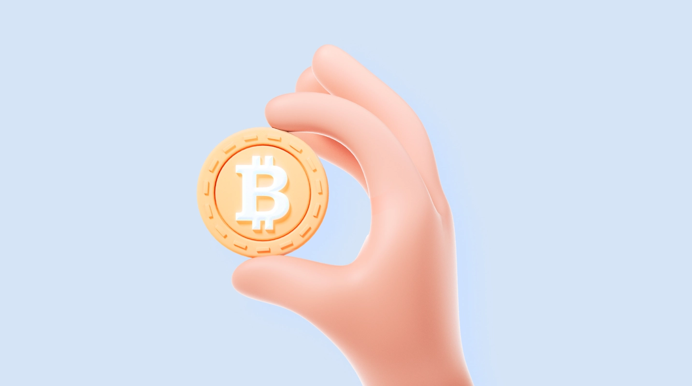

# What is Bitcoin ?

 Bitcoin is a decentralized digital asset. It is a new type of asset that joins the ranks of traditional assets such as cash, gold, and real estate

 Use the multichain Bitcoin.com Wallet app, trusted by millions to safely and easily buy, sell, trade, and manage bitcoin and the most popular cryptocurrencies

# Table of Contents

 What makes Bitcoin different?

 What gives Bitcoin value?

 How does Bitcoin work?

 Who controls Bitcoin?

 Why does Bitcoin exist? Is it needed?

 Is Bitcoin legal?

 Can bitcoin be stolen?

 Could there be a bug in the Bitcoin software?

 Can the Bitcoin network be shut down or hacked?
