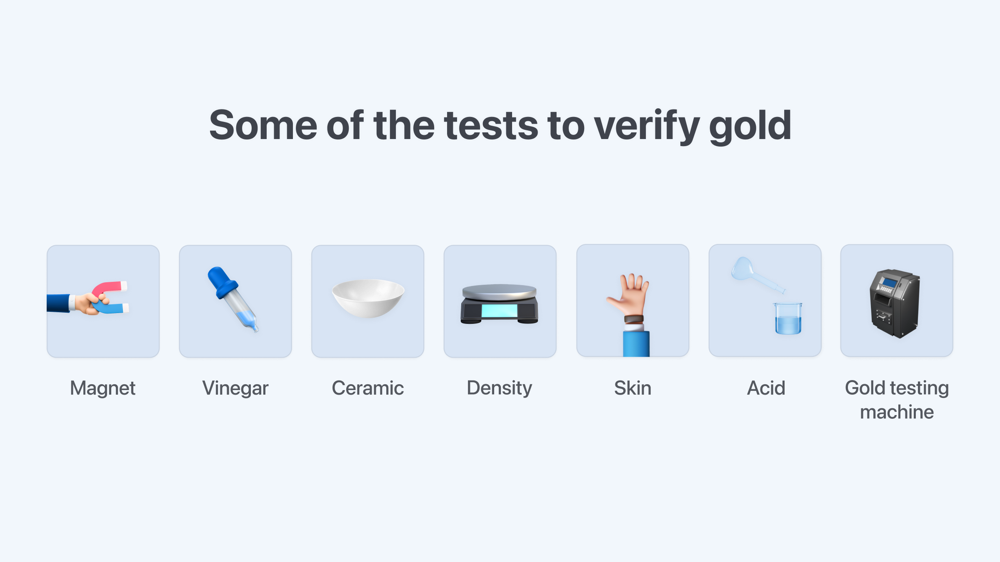

# What is Bitcoin ?

 Bitcoin is a decentralized digital asset. It is a new type of asset that joins the ranks of traditional assets such as cash, gold, and real estate

 Use the multichain Bitcoin.com Wallet app, trusted by millions to safely and easily buy, sell, trade, and manage bitcoin and the most popular cryptocurrencies

## Table of Contents

 [What makes Bitcoin different?](#what-makes-bitcoin-different)

 [What gives Bitcoin value?]()

 [How does Bitcoin work?]()

 [Who controls Bitcoin?]()

 [Why does Bitcoin exist? Is it needed?]()

 [Is Bitcoin legal?]()

 [Can bitcoin be stolen?]()

 [Could there be a bug in the Bitcoin software?]()

 [Can the Bitcoin network be shut down or hacked?]()

# What makes Bitcoin different?
Bitcoin is a **decentralized digital asset**. Let’s break that down.

Bitcoin is a decentralized digital asset

Bitcoin spans many traditional assets, such as cash and gold. For example, you can use it like money or as a store of value.

Another key to what makes Bitcoin different is its decentralized and “trustless" model. This means that trusted third parties (middlemen such as banks) aren’t necessary with Bitcoin. These third parties act as go-betweens, and are often called intermediaries.

In traditional finance there is always a business (usually more than one) in between your transactions.

What may seem like one go-between is often many more. Take a stock trading app for example. There can be up to a dozen intermediaries between you and a seller, each extracting a fee for their services!

Additionally, unlike almost all modern financial transactions which are electronic, physical cash and Bitcoin are similar in that they can be transacted directly, without third parties, and without asking for permission to create an account.

Exchanging cash directly doesn’t require intermediaries, **but the creation of cash is solely dependent on a trusted third party, such as a central bank**. The creation of new Bitcoin, by contrast, occurs programmatically and is limited to 21 million units. More on this later.

# What gives Bitcoin value?
The value of Bitcoin comes from two connected aspects that support and reinforce each other:

1. Its features
2. Its network effects

When a network grows, its utility grows also. The classic example is a telephone network. When there are only a few people on the network, it’s hardly valuable. But when you can call anyone, the network is more valuable. The same is true of money networks.

N

Historically, people have used everything from seashells to bottle caps as money, but arguably the most enduring form of money is gold. Why?

People settled on gold thanks to three key features: rarity, durability, and divisibility. These features made gold useful as a method for storing and exchanging value. Thanks to gold’s utility in this regard, the gold 'network' grew over time until gold became almost universally accepted as having value.  For hundreds of years, gold was the primary unit of account and reserve currency in much of the world. Recently, the US dollar has largely replaced gold, although gold does continue to have value.

Bitcoin is often compared to gold because it has similar characteristics. Namely:

**It has a limited supply**

There will only ever be 21 million bitcoins, which means Bitcoin is rare compared to other things that served as money like seashells, salt, and cash.

When things are not rare, they have less value over time. And if that is used as money, it leads to less purchasing power, which is the amount of goods and services that can be purchased with a set amount of money.

It's easily divisible

You can divide one bitcoin into 100 million pieces (100 million sats), whereas 1 US dollar can be broken into 100 pieces (100 cents). This means that the world will never “run out" of Bitcoin. It can always be divided into smaller and smaller pieces.

It's durable

The internet is durable because it is made up of a global network of computer systems. Similarly, a huge globally distributed network of independently operated computers tracks Bitcoin ownership. This ensures that no bitcoin is lost.

Beyond this, Bitcoin has a few other important features which improve upon gold's monetary properties. These are:

It's more portable

Sending any amount of bitcoin to anyone in the world can be done in minutes.

M

It’s more easily verified

It's easy to verify the authenticity of bitcoin. Actually, it's effectively impossible to transact with fake bitcoin, as opposed to many gold scams. The many gold verification methods attest to that.

It has stronger network effects

Although Bitcoin, which started in 2009, is much newer than gold, Bitcoin’s network effects benefit from the scale and speed of the internet. That’s because Bitcoin is a digital asset whose proponents are digital natives. So while the number of people who own Bitcoin has grown from zero in 2009 to over 100 million today, the number of people who own gold has remained relatively stagnant over the same period. It remains to be seen how wide the Bitcoin network will become, but if it were to achieve the same market cap as gold, each Bitcoin would be worth around $500,000.

# How does Bitcoin work?

First, let’s begin with how money usually appears in a bank. The money in a bank appears on a ledger.

Transactions such as salary and rent are recorded as deposits and withdrawals that modify the total balance.

You must trust that the bank keeps track of all transactions and balances on their ledger. In this way, the bank is a trusted third party, or middle man. Unfortunately, banks make mistakes often enough to warrant the existence of bank reconciliation statements which are used by companies and individuals to catch bank mistakes.

Bitcoin also has a ledger, but it's a decentralized ledger. Unlike at a bank or credit card company, transactions on the Bitcoin ledger are verified by a decentralized network of “nodes." Nodes are people who run the Bitcoin software, and anyone can be a node, without asking for permission.

Bitcoin’s ledger can only append new transactions. In other words, data can only be added, it cannot be edited or subtracted. This is important because it makes it next to impossible to change the history of the Bitcoin ledger.

The appended transactions are put into a block. The block is cryptographically connected to the previous block, making a chain of blocks (“blockchain") that creates an unbroken record going back to the very first transaction.

The nodes (again, people) in the Bitcoin network must agree that transactions are valid despite not trusting each other, and with the possibility of someone trying to lie about a transaction.

Having a group of strangers agree on the truth of something despite not being able to trust one another has been a difficult question for a long time – and it’s why global finance has always relied on a few trusted sources of truth like banks. Bitcoin was the first to solve this problem in a practical way.

The Bitcoin network operates on a set of rules. These rules govern things like making sure balances don’t spend more than they have, as well as other things like how many bitcoins can be created. Every time there is a new transaction, nodes check to make sure the transaction follows the rules, then pass it along to other nodes they are connected to.

The nodes in the decentralized network must agree that transactions are valid before the transaction can be added to the ledger, and the process of nodes agreeing is called consensus. There are several consensus mechanisms in the world of cryptoassets, but the one used by Bitcoin is called proof of work (PoW).

PoW is a mathematically guaranteed way to arrive at consensus, and it works by forcing participants to prove that they’ve completed some arbitrary calculations that consume energy (work). The requirement to spend energy is important because it makes it extremely costly for bad actors to participate.

The group of people who engage in Proof of Work in Bitcoin are called “miners." Bitcoin mining, which is the process of 'minting' (creating) new bitcoins, is an essential component of the network's system for arriving at consensus (agreeing to the 'truth') without relying on a centralized authority. Mining is also critical for ensuring the security of the network.

Read more: Find out how Bitcoin mining works and why it's needed.

# Who controls Bitcoin?
You may be asking, “Where did Bitcoin come from and how are its rules decided?"

The Bitcoin protocol is open-source software that was originally created by Bitcoin’s pseudonymous founder, Satoshi Nakamoto. Anyone in the world can run the software, and thousands of people have contributed to its development since launching in 2009. The group of people who voluntarily run the software form the Bitcoin network.

The Bitcoin protocol can change. And the way it changes is influenced by a much larger group of people than just those who run the software. This larger group includes the millions of holders of Bitcoin, the businesses that use Bitcoin, developers, and anyone else with a stake in Bitcoin. Collectively they decide what Bitcoin is.

Read more: Dive deeper into Bitcoin’s governance process and how Bitcoin evolves.

# Why does Bitcoin exist? Is it needed?
Bitcoin is an alternative form of digital money that is not issued by nation states or corporations and is not controlled by financial intermediaries like banks. People who find value in this new form of money include investors, libertarians, the financially oppressed (no matter where they live), and others.

Read more: Discover how Bitcoin is helping people around the world avoid financial oppression.

# Is Bitcoin legal?
Bitcoin is perfectly legal to hold in most countries, including all Western democracies, where freedom of speech is enshrined (Bitcoin is, after all, nothing more than open-source code). Some countries have attempted to ban the use of Bitcoin, but due to Bitcoin’s decentralized nature, it’s virtually impossible to enforce total bans.

# Can bitcoin be stolen?
With a few simple precautions in place, holding bitcoin is extremely secure. The vast majority of instances of bitcoin being “stolen" involve the victim mistakenly sending it to the attacker rather than a bitcoin wallet being hacked or stolen.

Read more: How to avoid the most common Bitcoin fraud attempts.

# Could there be a bug in the Bitcoin software?
Bugs have been found in the past, but they’ve never resulted in problems that can’t easily be fixed. Bitcoin’s code is constantly reviewed and there is huge motivation for attackers and others to discover bugs, yet no such attempts have proven successful. Importantly, if a catastrophic bug were exploited, the decentralized network of participants could collectively decide to roll back the clock to before the exploit, ensuring that no funds are lost or stolen.

# Can the Bitcoin network be shut down or hacked?
Shutting down the Bitcoin network would require shutting down the entire global internet and cutting all electricity. While it’s technically possible to “hack" or take over the entire Bitcoin network, doing so would cost billions of dollars and require a massive coordinated effort involving global chip manufacturers. Importantly, even if successful, a hacker would not be enriched by the attack since it would destroy the value of the Bitcoin network.